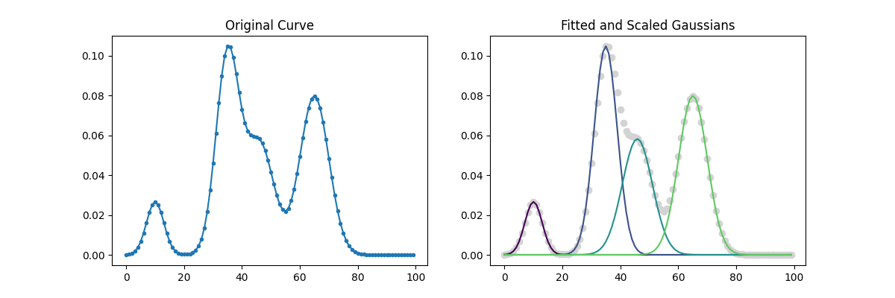

# Histogram GMM
A Gaussian Mixture Model implementation that works with a histogram instead of using raw data points.

This implementation is useful for fitting data that has the form of a sum of gaussian curves, but it can also be used as a typical GMM implementation by computing a histogram of data points.

## Installation
As of now, this is not on PyPI, so the easiest way to install it is by cloning this repo and then installing it with pip:
```shell
git clone https://github.com/thomasvf/histgmm.git
cd histgmm
pip install .
```

## Usage

The example below shows how `HistogramGMM` can be used to fit the GMM to a sum of gaussians. 
It's also available as a Jupyter notebook [here](examples/basic_example.ipynb).

```python
import numpy as np

from histgmm import HistogramGMM
from histgmm.utils import gaussian_1d

# create data for the example
x = np.arange(0, 100, 1)
h = gaussian_1d(x, A=0.2, mu=10, var=9) + \
    gaussian_1d(x, A=1, mu=35, var=16) + \
    gaussian_1d(x, A=0.7, mu=46, var=25) + \
    gaussian_1d(x, A=1, mu=65, var=25)


# fit using 4 components
model = HistogramGMM(n_components=4, n_dimensions=1)
model.fit(x.reshape(-1, 1), h)
```

The fitted gaussians can be plotted over the original data using the function `plot_1d_gaussian_fit`, as shown below.

```python
import matplotlib.pyplot as plt
from histgmm.visualization import plot_1d_gaussian_fit

fig, ax = plt.subplots(1, 2, figsize=(12, 4))
ax[0].plot(x, h, marker='.')
ax[0].set_title('Original Curve')

plot_1d_gaussian_fit(gmm=model, X=x.reshape(-1, 1), h=h, ax=ax[1])
ax[1].set_title('Fitted and Scaled Gaussians')

plt.show()
```
<p align="center">
  
</p>


## Model Formulation
See the PDF in [here](docs/histgmm_formulation.pdf).

## Credits

This package was created with Cookiecutter_ and the `audreyr/cookiecutter-pypackage`_ project template.

.. _Cookiecutter: https://github.com/audreyr/cookiecutter
.. _`audreyr/cookiecutter-pypackage`: https://github.com/audreyr/cookiecutter-pypackage
